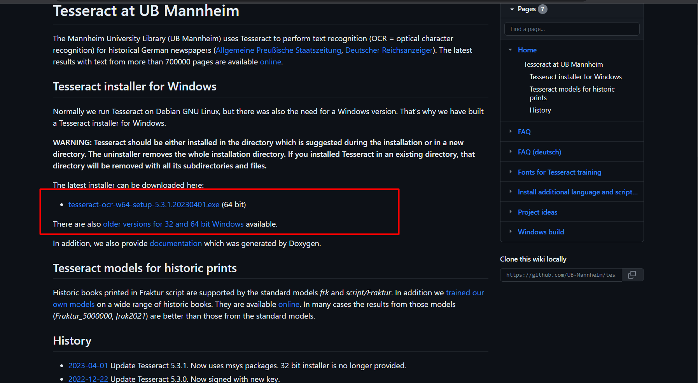

# Laravel OCR Package


The Laravel OCR package provides optimal character recognition capabilities in Laravel applications. It integrates with Tesseract OCR and offers features such as offline OCR, language selection, and more.

## Table of Contents

- [Package Dependencies](#package-dependencies)
- [Installation](#installation)
  - [Software Installation](#software-installation)
  - [package Installation](#package-installation)
- [Usage](#usage)
  - [Routes and Controllers](#routes-and-controllers)
  - [Available Languages](#available-languages)
  - [User Words](#user-words)
- [Current and Upcoming Features](#current-and-upcoming-features)
- [Contributing](#contributing)
- [License](#license)

## Package Dependencies

This package depends on Tesseract OCR. Before using the Laravel OCR package, you must install Tesseract OCR on your server. You can find installation instructions for various operating systems on the Tesseract OCR  Page  [https://github.com/tesseract-ocr/tesseract](https://github.com/tesseract-ocr/tesseract).

## Installation

### Software Installation

For Windows users, we provide installation guidance in the screenshot. Please clich the [https://github.com/tesseract-ocr](https://github.com/tesseract-ocr) to install Tesseract OCR on your Windows machine.



For general users and not windows specifically, you can visit [https://tesseract-ocr.github.io/tessdoc/Installation.html](https://tesseract-ocr.github.io/tessdoc/Installation.html)

### Package Installation

To install the Laravel OCR package, you can use Composer:

```bash
composer require hossamsoliuman/laravel-ocr
```
# Usage
## Routes and Controllers

### Routes
This package provides routes and controllers for OCR processing. You can access the OCR functionality via the following routes:

- **POST /offline-ocr/image**: Perform offline OCR on an image.
  - Accepts `image` (image file) and `lang` (language selection) parameters.
  - Optional `user_words` parameter for user-specific words (see User Words).

- **GET /languages**: Retrieve a list of available languages for OCR.

Make sure to include these routes in your Laravel application as needed. You can also customize the routes and controllers to fit your application's requirements.

### Available Languages
You can select the language(s) for OCR processing using the `lang` parameter when making requests. By default, English (`eng`) is used. You can specify multiple languages as a comma-separated list, e.g., `eng,ara`.

To retrieve a list of available languages, you can access the `/languages` route.

### User Words
You can provide a user-specific words file to improve OCR accuracy when dealing with technical terminology or jargon. To use user words, include the `user_words` parameter when making OCR requests, and provide a text file containing the desired words.

**Example usage**:

```bash
curl -X POST -F "image=@image.png" -F "user_words=@user-words.txt" http://your-app.com/offline-ocr/image
```

## Current and Upcoming Features

Here's a table detailing the current and upcoming features of the Laravel OCR package:
| Feature             | Status       |
|--------------------|--------------|
| Offline OCR         | :white_check_mark: Available  |
| Language Selection  | :white_check_mark: Available  |
| User Words          | :white_check_mark: Available  |
| Download Language Support | :hourglass_flowing_sand: Upcoming |
| PDF Support| :hourglass_flowing_sand: Upcoming  |
| Google vision Support| :hourglass_flowing_sand: Upcoming  |
|More Features| :hourglass_flowing_sand: Upcoming  |

## Contributing

Contributions are welcome! We appreciate your interest in improving this package. To get started with contributing, please read our [contribution guidelines](CONTRIBUTING.md). Your contributions can help make this package even better.

## License

This package is open-source software licensed under the [MIT License](LICENSE). You are free to use, modify, and distribute this software in accordance with the terms of the MIT License. See the [LICENSE](LICENSE) file for more details.
